# Dockers

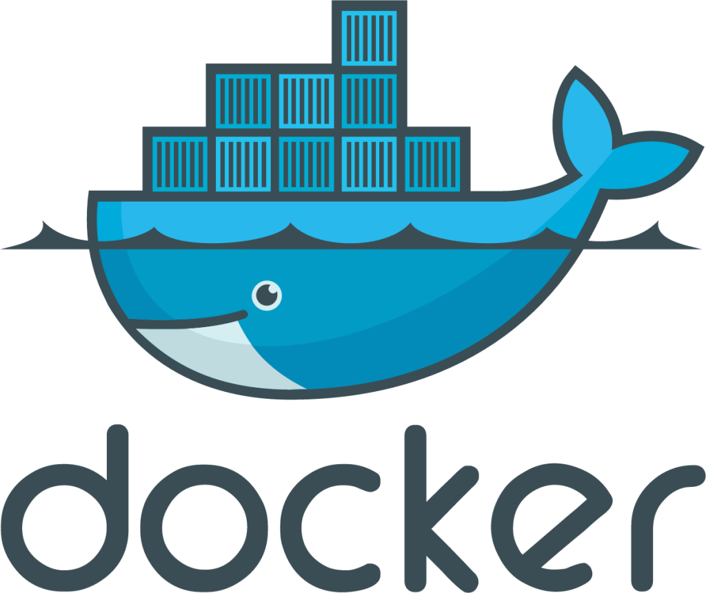

# Table of Contents

- [Virtualization](#virtualization)
  
  - What is virtualization
  - Virtualization History 
  - Traditional Physical server v/s virtual server 
  - Types of virtualization
  - Virtualization Benefits 
- [Introduction](#introduction)

  - [Evolution of Containerization](#evolution-of-containerization)

    - Market view Evolution of IT
    - Challenges of Microservices 
    - Results in NxN compatibility nightmare
    - Analogy of shipment container

- [Containers and Virtual Machines](#containers-and-virtual-machines)
- [Docker Advanatages](#advantages)
- [Docker Architecture](#docker-architecture)
- [Docker Installations](#docker-installations)
- [Docker Hub](#docker-hub)
- [Pull image from docker hub](#pull-docker-image-from-docker-hub)
- [Storage of the docker resources in local machine](#storage-of-the-docker-resources-in-local-machine)
- [Namespaces](#namespaces)
- [C groups](#cgroups)
- [Push image to docker hub](#push-custom-image-to-docker-hub)

  - [Exercise 1: Pull a Busybox image from docker hub, echo hello world and build image and push to docker hub](#exercise1)
  - [Exercise 2: Modify the index.html of nginx container & push to the docker Hub](#exercise2)

- [Volumes](#docker-volumes)

  - [Create and manage volumes](#create-and-manage-volumes)
  - [Start a container with a volume](#start-a-container-with-a-volume)
- [Networking](#docker-network)
- [Docker UI Portal](#docker-ui-portal)
- [Docker file](#docker-file) 

  - [Dockerfile commands](#dockerfile-commands)
  - [Creating custom Docker images with Dockerfiles](#creating-custom-docker-images-with-dockerfiles)
- [Docker compose](#docker-compose) 
  
  - [Docker compose commands](#docker-compose-commands)
- [Best practices for creating efficient Docker images](#best-practices-for-creating-efficient-docker-images)
- [Essential commands](#docker-essential-commands) 
- [Assessment1 - Build todoapi docker image and push to docker hub](#assessment1-build-todoapi-image-and-push-to-docker-hub)
- [Assessment2 - Docker compose todoapi with mysql](#assessment2-docker-compose-todoapi-with-mysql)
- [References](#references)

# Virtualization

Virtualization is creation of an alternative to actual version of something.

- virtual memory (more memory than physically available)
- virtual time (buffering provides virtual/effective download time that less than the actual time)
- virtual hardware, desktop, disk, appliances, scenes
- Virtual worlds
In our context it is realizing one or more complete computer systems as guests on the
base machine/operating system.
This offers an excellent conduit for delivering the vastly underutilized power of the multi-
core and other resources such as storage and devices.

**To define it in a general sense,**

`Virtualization` encompasses any technology either software or hardware that adds an extra layer of isolation or extra flexibility to a standard system.

Familiar examples include,

- virtual memory for memory management
- virtual disks to allow for partitioning
- "virtual machines" (eg. for of Java and get) to allow for better software portability.
 
**Virtualization History**

Born from Mainframe Technology:

- Originally part of mainframe technology, Virtualization is not a new concept.
- Mainframes started as very large computers in the 1960s to process compute tasks.


**Virtualization on a Mainframe**

Mainframe Virtualization:

- Concept was to split the computer into multiple virtual machines so different "tasks" can be run separately
and independently on the same mainframe.

- If one virtual machine or "task" has a problem, other virtual machines are unaffected

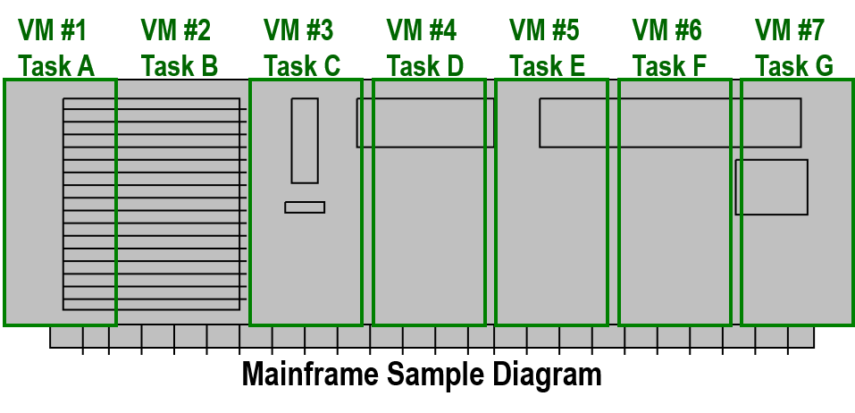

**Computers in 1990**

Fast Forward to the 1990s

- Intel/AMD servers now very popular (known as "x86" servers)
- Each server runs Operating Systems such as Microsoft, Linux, or Netware
- Companies put ONE operating system & ONE application on each server
- 2 servers would grow to 6 sewers, eventually to 50 or more servers!
- Electricity and space (footprint) becomes a problem...

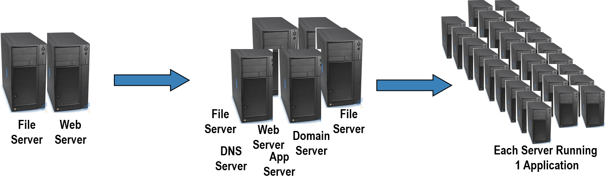


**Computers in 2000**

Fast Forward to the 2000s

- Manufacturers "to the rescue"!
- Focus on making servers small
- "Rack" form factors (320 servers per cabinet)
- "Blade" form factors (30—60 servers per cabinet)
- Space/footprint problem helped....some
- Electricity and heat still a problem

**As Servers Got Faster...**

- Server utilization became even lower
- Average server utilization ranges between 4 -10%
- STILL one application per server

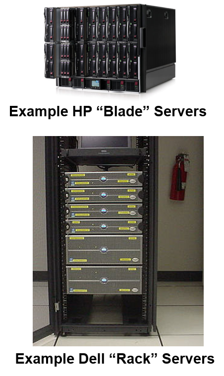

**Virtualization is the Key**

Apply Mainframe Virtualization Concepts to Intel/AMD Servers:

- Use virtualization software to partition an Intel/AMD server to work with several operating system and application "Instances"

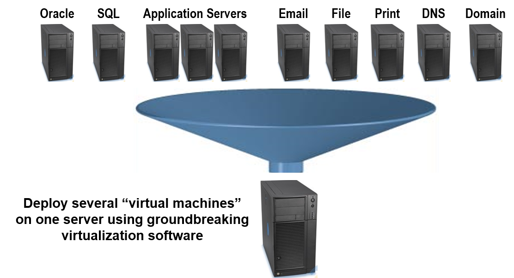

**Traditional Physical Server**

Traditional x86 Server Architecture

- Single operating system per machine
- Single application per machine
- Hardware components connected directly to operating system
  
  - CPU
  - Memory
  - Disk
  - Network Card

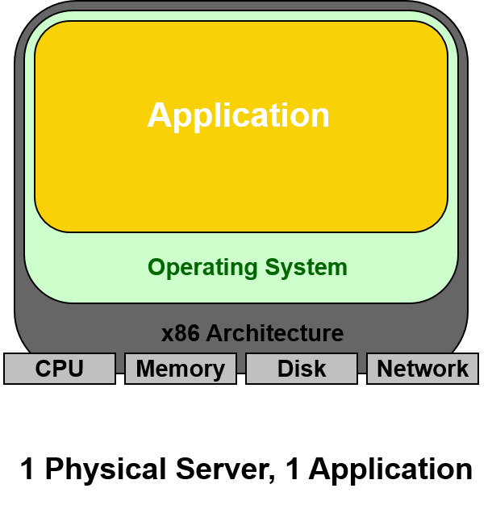

**New Architecture: Virtual Server**

Virtualization Layer

- Addition of a Virtualization layer called a "hypervisor"
- Several servers can be deployed as Virtual Machines (VM) on each physical box
- Each VM has its own operating system and application
- Can run multiple, different operating systems on the same machine
- If one VM fails, other VMs are unaffected

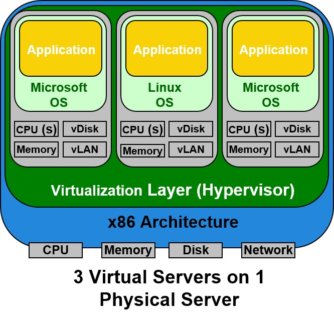

**Virtualization Layer Explored**

**Virtualization Layer — Compatibility**

- A virtual machine is compatible with standard x86 operating
systems such as Windows and Linux

- A virtual machine has a motherboard,cpu, memory, disk and network just like a physical server
- Applications developed for the standard 08's will work on a virtual machine
- No adjustments are needed to run applications on virtual servers

**Virtualization Layer - Isolation**

- Virtual machines on the same physical machine run independently
- They are protected from each other

**What is Hypervisor?**

"Hypervisor is a software layer sits between Hardware and OSes which will interact with hardware and resources and provide an interface to share the available resources to Virtual containers."

**Hypervisor-based Virtualization**

Technologies that fall into this category can be divided into two basic types:

- Type 1 (or native, bane-metal) hypervisors
  
  - are software systemsthat run directly on the host's hardware to control the hardware and 0 monitor guest operating systems.
  - A guest operating system thus runs on another level above the hypervisor.

- Type 2 (or hosted) hypervisors

  - are software applications running within a conventional operating system environment
  - Guest operating systems thus run at the third level above the hardware.

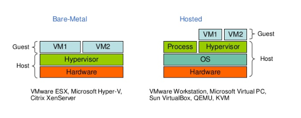


**OS Virtualization**

- Instead of simulating an entire set of hardware, the existing OS is"partitioned" to cater to several isolated applications that are all operating under the impression that they have sole control of the OS.
- Though this remains restricted to the use of one kernel, the partitions can use different distributions and/or drivers and run completely independently.
- Advantage : the amount of overhead created on the host system is greatly reduced compared to hardware Virtualization, as there is no need to maintain a complete set of hardware for each partition.
Ex: Linux-based systems: OpenVZ

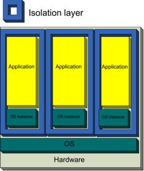

- Every partition has its own network address and its own set of login credentials, system processes and daemon services.
- Because the underlying operating system is always running, each partition can be rebooted independently and data can be migrated from one virtual environment to another on a live host.

**Application Virtualization**

- Applications are turned into isolated, self-contained packages that are able to operate under an OS and use all of its resources.
- Because the packages are basically a complete environment they no longer require installation, thus providing extremely easy software distribution along with the safety of a completely isolated application.
- Examples : the Common Language Runtime environment of the .NET Framework and the Java Virtual Machine.

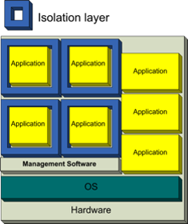

**Virtualization Benefits**

- Consolidation
- Redundancy
- Legacy hardware
- Migration
- Centralized management

# Introduction  

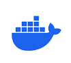
Docker is a `container management` service. The keywords of Docker are `develop, ship and run` anywhere. 
<br>
The initial release of Docker was in `March 2013` and since then, it has become the buzzword for modern world development, especially in the face of Agile-based projects.
<br> 
Docker is the containerization platform that is used to package your application and all its dependencies together in the form of containers to make sure that your application works seamlessly in any environment which can be developed or tested or in production. 
Docker is a tool designed to make it easier to create, deploy, and run applications by using containers. 

## Evolution of Containerization 

**Market View: Evolution of IT**

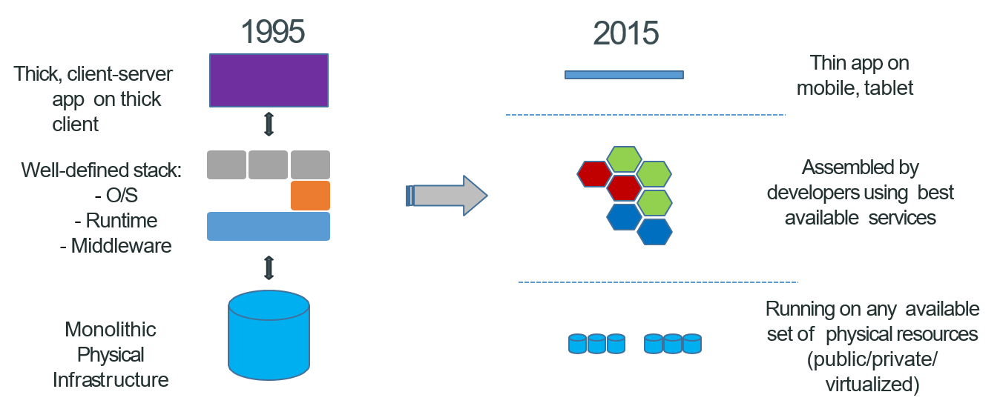

In 1995, Monolithic applications were characterized by their single, large codebase that contained all the functionality of the application. The infrastructure supporting these applications was typically composed of physical servers or, in some cases, virtual machines. Deployment and scaling were complex and time-consuming processes, often requiring manual intervention. Scaling horizontally or handling traffic spikes required significant over-provisioning of resources, resulting in inefficient resource utilization. High availability was achieved through redundancy, often leading to expensive data center setups. Monitoring and debugging were challenging, with limited visibility into the application's internal components.

Now, the software landscape has undergone a profound transformation. Modern microservices-based applications have become the norm. These applications are built as a collection of small, loosely coupled services, each responsible for a specific function or feature. Microservices are developed, deployed, and maintained independently, enabling greater agility and scalability. 

**Challenges of Microservices**

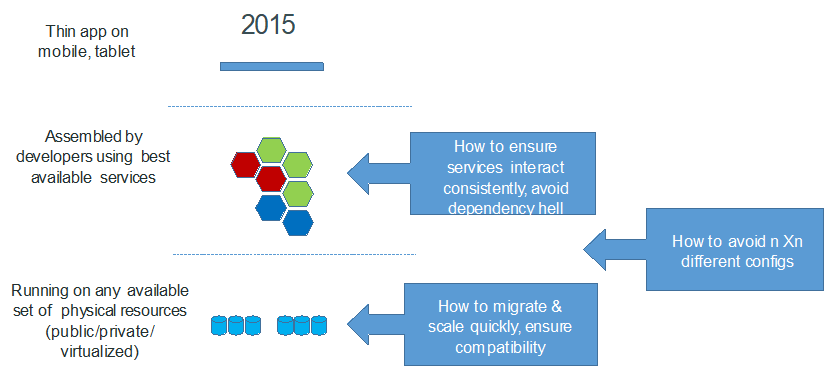

The early attempts at microservices faced several challenges,

`Data Management:` Handling data in a microservices architecture was problematic. There were issues related to data consistency, database schema changes, and managing databases for each microservice.

`Complexity:` Breaking down monolithic applications into smaller services introduced complexity in terms of service discovery, communication, and orchestration. 

`Deployment and Scaling:` Deploying and scaling individual services manually was time-consuming and error-prone. Automation tools and containerization technologies were not as mature as they are today, making it challenging to manage deployments efficiently.

`Dependency Management:` The more microservices you have, the more dependencies they can create. If microservices depend on other microservices, changes to one service may impact several others. Managing and versioning dependencies can become exponentially complex as the number of services increases.

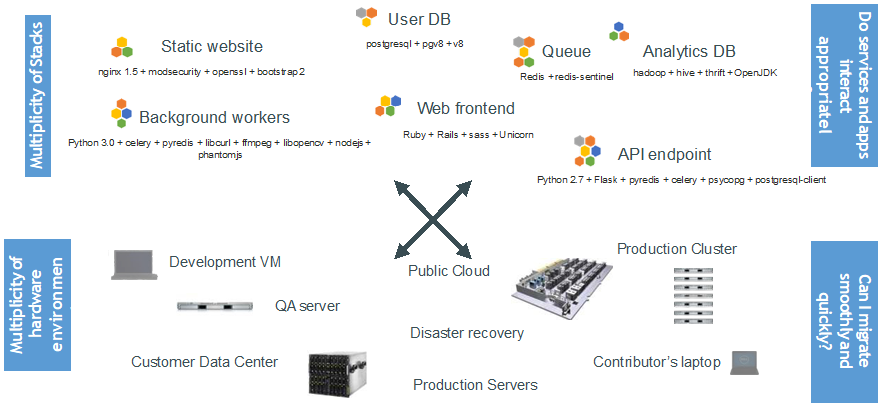

**Results in N X N compatibility nightmare**

As the number of microservices grows, the number of possible service-to-service communication paths increases exponentially. Each microservice may need to communicate with multiple other services, leading to a complex web of interactions. Managing and securing these communications become challenging.

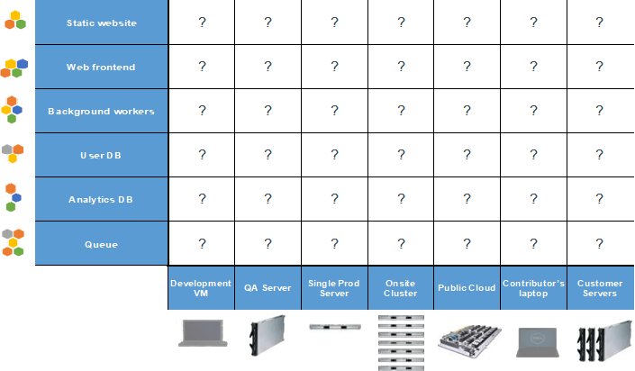

**The Analogy**

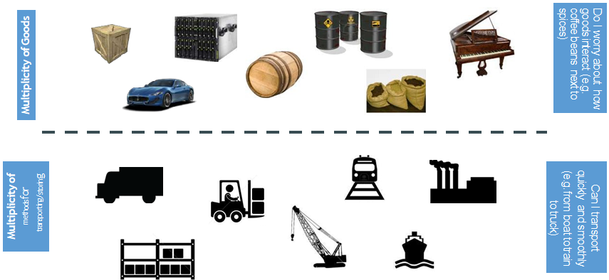

Let us consider an analogy to understand. We are trying to transport a piano, cars, oil cans, spices etc. There are various factors to consider. You cannot choose one mode of transportation. It depends on what we are triyng to transport. Also, You may have to consider where that has to be placed. You cannot place oil conatiners next to spices. It may leak right? 

**Also an NxN Matrix**
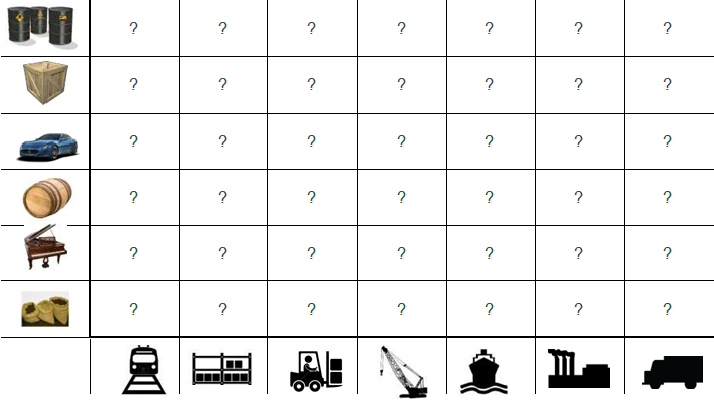

**Solution: Intermodal Shipping Container**

So, then comes the Intermodal shipping container. A standard container that is loaded with any goods, and stays sealed until it reaches the final delivery.

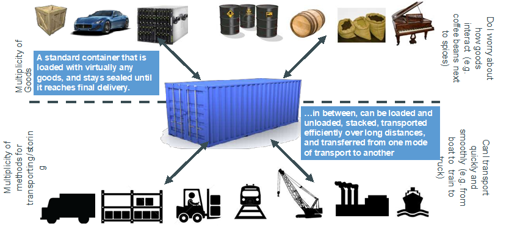

**Docker is a shipping container system for code**

Docker is one such shipping conatiner system for our code. An Engine taht enables any payload to be encapsulated as a light weight, portable, self sufficient containers. These containers can be manipulated using standard operations and run consistently on virtually any hardware platform.

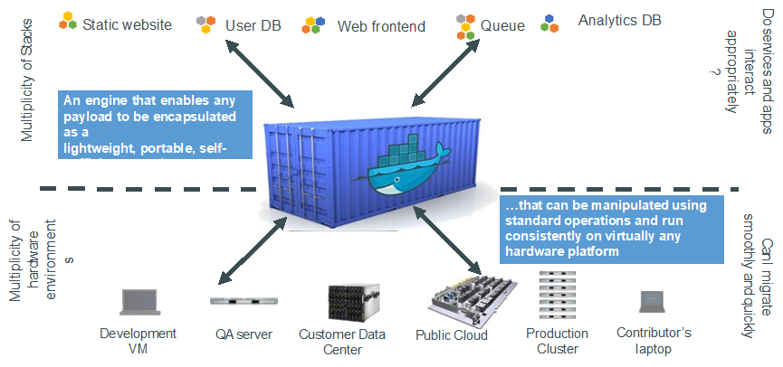

# Containers and Virtual Machines


**Virtual Machines**

- Virtual Machines (VMs) run on Hypervisors, which allow multiple Virtual Machines to run on a single machine along with its own operating system.
- Each VM has its own copy of an operating system along with the application and necessary binaries, which makes it significantly larger and it requires more resources.
- They provide Hardware-level process isolation and are slow to boot.

**Docker Containers**

- Docker Containers contain binaries, libraries, and configuration files along with the application itself.
- They don’t contain a guest OS for each container and rely on the underlying OS kernel, which makes the containers lightweight.
- Containers share resources with other containers in the same host OS and provide OS-level process isolation.

# Advantages

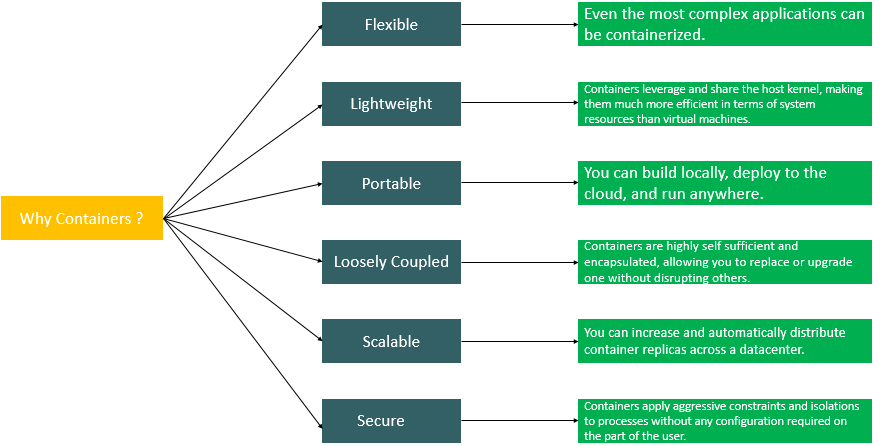

# Docker Architecture

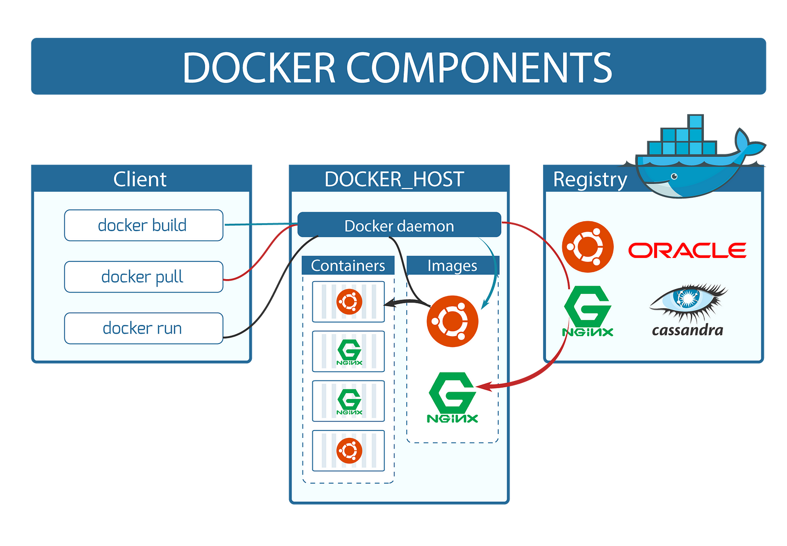

Docker makes use of a `client-server` architecture. The Docker client talks with the `docker daemon` which helps in building, running, and distributing the docker containers. The Docker client runs with the daemon on the same system or we can connect the Docker client with the Docker daemon remotely. With the help of `REST API` over a  UNIX socket or a network, the docker client and daemon interact with each other.

**Docker Daemon:**

The Docker daemon (dockerd) listens for Docker API requests and manages Docker objects such as images, containers, networks, and volumes.

**Docker Client:**

Docker client can be present on either Docker Host or any other machine. The main objective of the docker client is to provide a way to direct the pull of images from the docker registry and run them on the docker host. The common commands which are used by clients are docker `build`, docker `pull`, and docker `run`.

The Docker client can communicate with more than one daemon.

**Docker Host:**

A Docker host is a type of machine that is responsible for running more than one container. It comprises the Docker daemon, Images, Containers, Networks, and Storage.


**Docker Registry:**

All the docker images are stored in the docker registry. There is a public registry which is known as a docker hub that can be used by anyone. We can run our private registry also. 

**Docker Images:**

An image is a read-only template with instructions for creating a Docker container.
Often, an image is based on another image, with some additional customization. 
For example, we may build an image which is based on the ubuntu image, but installs the Apache web server and our application, as well as the configuration details needed to make our application run.


**Docker Containers:**

A container is a runnable instance of an image. 
We can create, start, stop, move, or delete a container using the Docker API or CLI. 
We can connect a container to one or more networks, attach storage to it, or even create a new image based on its current state.
When a container is removed, any changes to its state that are not stored in persistent storage disappear.

# Docker Installations

> [Install docker- click here](https://docs.docker.com/install/)

To install docker on Linux,

```bash +@Output
$ apt install docker.io
```
<details>

```
# Troubleshooting Docker Desktop issues on MAC
# Docker Desktop on mac has an issue with MAC osxkeychain
# To fix it perform the below steps.

Step-1:Docker Desktop changes
	- Open Docker Desktop --> Preferences
	- Uncheck the option named **Securely store Docker logins in macOS keychain

Step-2: Go to config.json file in .docker folder		
	- Sample Reference Location: 
		- /Users/<userid>/.docker/config.json
		- ~/.docker/config.json
	- Remove the line “credSstore” : “osxkeychain”, in config.json
```
</details>

# Docker Hub


- A Docker registry stores Docker images.
- Docker Hub is a `public registry` and it is a `cloud-based service` where people push their Docker Container Images and also pull the Docker Container Images from the Docker Hub anytime or anywhere via the internet.
- We can even run our own private registry. 
- When we use `docker pull` or `docker run` commands, the required images are pulled from our configured registry. 
- When we use the `docker push` command, our image is pushed to our configured registry.

> [Create a docker hub account If you dont have one..](https://hub.docker.com/)

# Pull Docker Image from Docker Hub

`Docker Image` is an executable package of software that includes everything needed to run an application. This image informs how a container should instantiate, determining which software components will run and how. 

`Docker Container` is a virtual environment that bundles application code with all the dependencies required to run the application. The application runs quickly and reliably from one computing environment to another.

**Verify Docker version and also login to Docker Hub** 

```bash +@Output
$ docker version
$ docker login
#Login to your docker hub with your credentials
```

## Example 1

**Pull Alpine Image from Docker Hub**

```bash +@Output
$ docker pull alpine
```

The docker pull alpine command is used to download an Alpine Linux Docker image from the Docker Hub repository. 

> Alpine Linux is a lightweight, security-focused Linux distribution known for its small size and simplicity. It's often used as a base image for Docker containers because of its minimal footprint.

**List Docker Images**

```bash +@Output
$ docker images 
$ docker image ls
```

**List images with full-length IDs** 

```bash +@Output
$ docker images --no-trunc
```

**Docker Image inspect**

```bash +@Output
$ docker image inspect  <image id>
```

**Run the downloaded Docker Image & Access the Application**

```bash +@Output
$ docker run alpine 
```

To run the image, we use `docker run` command. Executing this command will create a container. 
If you observe this container by listing the containers using `docker ps -a`, you could notice the conatiner started and exited immediately. 
This is because the OS doesnot have a task to execute.

**List Running Containers**

```bash +@Output
$ docker ps
```

**List Running Containers**

```
$ docker ps -a
$ docker ps -a -q
```

## Example 2

Let us pull the ubuntu image which has all the executables and see, 

**Pull Ubuntu Image from Docker Hub**

```bash +@Output
$ docker pull ubuntu
```

**List Docker Images**

```bash +@Output
$ docker images 
```

**Run the Image**

```bash +@Output
$ docker run -d ubuntu sleep 5000  
# -d : run in detached mode 
```

**List Running Containers**

```bash +@Output
$ docker ps
```

Now, you can see the `container running` in the detached mode and is up and running. 
If you dont give any task, the container dies immediately as it starts 

You can test this by running the same ubuntu image with the below command 

```bash +@Output
$ docker run ubuntu 
```

## Example 3

**Pull nginx Image from Docker Hub**

```bash +@Output
$ docker pull nginx
```

**List Docker Images**

```bash +@Output
$ docker images 
```

**Run the downloaded Docker Image & Access the Application**

```bash +@Output
$ docker run --name <container-name> -p 8080:80 -d nginx 
# -p publish the port on host machine 
```

**List Running Containers**

```bash +@Output
$ docker ps
```

> Access the application, http://localhost:8080 or do a curl of http://localhost:8080

**Connect to Container Terminal**

```bash +@Output
# Login to container 
$ docker exec -it <container-name> /bin/sh
# -it - Interactive Terminal 
# This command will connect to the new system with interactive terminal 

# Install procps
$ apt-get update
$ apt-get install procps

# list process running in container
root@04707a043ac9:/# ps -ef

# exit from the container
root@04707a043ac9:/# exit
```

## Other container commands

**Inspect a Contianer**

```bash +@Output
# Docker container inspect
$ docker inspect <container-name>
```

**Stop and Start and restart a Contianer**

```bash +@Output
# Container Stop, Start
$ docker stop <container-name>
$ docker start  <container-name>
$ docker restart <container-id>
```

**Remove a Contianer**

```bash +@Output
# Remove Container
$ docker stop <container-name> 
$ docker rm <container-name>
```

**Pause and unpause a Contianer**

```bash +@Output
$ docker pause <container-id>
$ docker unpause <contianer-id>

```

**Rename a container**

```bash +@Output
$ docker rename <container-id> <new-name>

```

**Image history**

```bash +@Output
# Docker image history
$ docker image history <image id>
```

**Remove a Image**

```bash +@Output
# Remove Image
$ docker images
$ docker rmi  <image-id>
$ docker rmi <name:tag>
```

**Remove unused images**

```bash +@Output
# Remove Unused Images
$ docker image prune
```

**Look at the CPU ,Memory and storage, network performance of container**

```bash +@Output
# Look at the CPU ,Memory and storage, network performance of container 
$ docker stats <container-id>
```

 **Delete all containers which are not running**

```bash +@Output
# Delete all containers which are not running:
$ docker rm $(docker ps -a -q)

```

> Note : You cannot delete a container which is in start state

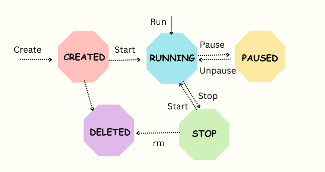


# Storage of the docker resources in local machine  

```bash +@Output
$ docker info 
```

It provides all the information about the configuration. If you scroll down you can notice `Docker root Dir`
This is the directory all our images, containers are stored in the local machine.
If we navigate to that location, you could notice all the resources images, containers etc..

In Linux usually the location would be , `var/lib/docker`

In windows the location would be, `\\wsl.localhost\docker-desktop-data\data\docker`

# Namespaces

Namespaces and cgroups are fundamental Linux kernel features that play a crucial role in containerization technologies like Docker. 

Namespaces provide `isolation` for processes and resources on a Linux system. They allow multiple processes to have their own view of the system, preventing them from interacting with or even being aware of each other. 

Docker leverages several types of namespaces to isolate different aspects of a container.

1. **PID (Process ID) Namespace:**

- Isolates the process IDs, making it appear as if each container has its own process tree.

- Containers cannot see processes in other containers.

2. **Network Namespace:**

- Isolates network interfaces, IP addresses, routing tables, and network-related resources.
- Provides each container with its own network stack.

3. **Mount Namespace:**

- Isolates the filesystem mount points.
- Each container has its own root filesystem, and changes inside the container do not affect the host or other containers.

4. **UTS (Unix Time-Sharing) Namespace:**

- Isolates the hostname and NIS domain name.
- Allows each container to have its own hostname.

5. **IPC (Inter-Process Communication) Namespace:**

- Isolates IPC resources such as message queues and semaphores.
- Containers cannot interfere with the IPC resources of other containers.

6. **User Namespace:**

- Isolates user and group IDs, allowing containers to have their own user namespace.
- Enhances security by mapping container-specific user and group IDs to host IDs.

**Exercise:** Switch between the process namespaces by using nsenter, get the process id and run the below commands with specific name spaces.

**Verify PID, Namespaces, CGroups**

```bash +@Output

$ docker run -d --hostname hname --name test ubuntu:18.04 sleep 5000
$ ps aux | grep sleep
$ docker inspect test | grep -i pid
$ apt-get update
$ apt-get install net-tools
$ ifconfig

```
> UTS = Unix Time Sharing, where the this manages the multi-user or multi-tasking isolation.

```bash +@Output
$ nsenter --target <pid> --uts
$ hostname
$ nsenter --target <pid> --net
$ ifconfig
$ exit

```

> Exit from nsenter to get back normal.

**Verify the host name**

```bash +@Output
$ Docker exec -it test sh
$ hostname
$ ifconfig
$ exit
$ hostname
$ ifconfig

```

> Here the result of these commands will be different as the namespace associated with each process is different.

# CGroups

Control Groups (cgroups) allow the `allocation of resources` and setting limits on resource usage for a group of processes. 

Docker uses cgroups to control and limit resources such as CPU, memory, disk I/O, and network bandwidth for containers.


```bash +@Output
$ cat /proc/<pid>/cgroup

$ cat /sys/fs/cgroup/memory/system.slice/<docker-id>/memory.limit_in_bytes

$ docker run -d --memory 400m --hostname hname1 --name test1 ubuntu:18.04 sleep 5000

```

# Push custom image to Docker Hub

**Exercise: Pull the ubuntu image and install curl. Create an image out of it and push to docker hub**

**Prerequisites:** [Required Docker hub account](https://hub.docker.com/)

`Lets us pull the ubuntu base image and install curl`

**Pull the base image from the docker hub**

```bash +@Output 
$ docker pull ubuntu:18.04 
```

**Run the image as container** 

```bash +@Output
$ docker run -i -t --name container1 ubuntu:18.04 /bin/bash 
```

**Install curl on your conatainer**

```bash +@Output
root@9d9d6e9dc6dc:/# apt  update 
root@9d9d6e9dc6dc:/# apt install curl
$ exit 

```

**Commit the container to get the image**

The docker commit command in Docker allows you to create a new image from a running container. It's a way to save the current state of a container as a new image, which can be useful for various purposes, such as creating custom images based on existing containers or capturing the changes you've made within a container for future use.

```bash +@Output
$ docker commit <containerid> imagename:version 
```

**List the images**

```bash +@Output
$ docker images 
# You should see your image in the list.
```

**Run the custom image**

```bash +@Output
$ docker run -i -t imagename:version /bin/bash
```

**Try installing git again - Notice the difference**

```bash +@Output 
root@87656d52abac:/# curl
# Now you should be able to see curl already been installed 
root@87656d52abac:/# exit

```

**Tag your image**

The docker tag command is used to assign a new tag to an existing Docker image.


```bash +@Output
# Syntax:
$ docker tag SOURCE_IMAGE[:SOURCE_TAG] TARGET_IMAGE[:TARGET_TAG]

$ docker tag imagename:version reponame/imagename:version
```

**Push the image to docker hub**

The docker push command is used to push (upload) Docker images from your local environment to a container registry. Container registries are repositories where Docker images are stored and can be pulled by others. Common container registries include Docker Hub, Google Container Registry, Amazon Elastic Container Registry (ECR), and others.

```bash +@Output
$ docker push reponame/imagename:version
```

**Now remove image from local repository**

```bash +@Output 
$ docker rmi -f <imageid>
```

**List the docker images- notice the image been removed**

```bash +@Output
$ docker images
```

**Run the custom image you created**

```bash +@Output
$ docker run -it reponame/imagename:version

```

## Exercise1 

Pull a `Busybox` image from docker hub, `echo hello world` and build image and push to docker hub 

> BusyBox is a lightweight and minimalistic Linux distribution that provides a collection of essential Unix utilities bundled into a single executable.

**Run the container**

```bash +@Output
$ docker run --name container1  busybox echo 'Hello world’
```

**Save the image**

```bash +@Output
$ docker commit <container id/name> reponame/imagename:version
```

**Push the image to docker hub**

```bash +@Output 
$ docker push reponame/imagename:version
```

**Delete the image from local repo**

```bash +@Output
$ docker rmi -f <imageid>
```

**List the images**

```bash +@Output
$ docker images
```

**Run your image**

```bash +@Output
$ docker run --name mycontainer reponame/imagename:version
```

**Stop the container**

```bash +@Output
$ docker stop <containerid>
```

**Remove the container**

```bash +@Output
$ docker rm -f <containerid>
```

## Exercise2

Modify the index.html of nginx container & push to the docker Hub

**Run the base Nginx container**

```bash +@Output
$ docker run --name <containername> -p 80:80 -d nginx
$ docker run --name mynginx -p 80:80 -d nginx
$ docker ps
```
> Access the application, http://localhost

**Login to the container**

```bash +@Output
$ docker exec -it <containername> /bin/bash
```

**Modify the content in index.html**

```bash +@Output
$ cd /usr/share/nginx/html
$ cat index.html
# Modify the content
$ apt-get update
$ apt install vim
$ vi index.html
# Edit the content
# Mofidy Welcome to nginx! to Welcome to Docker Learning! 
# exit from editor 
$ !wq
# Exit from the container 
$ exit
```
> Notice the changes- http://localhost

**Save the image**

```bash +@Output
$ docker commit <container id/name> reponame/imagename:version
```

**Push the image to docker hub**

```bash +@Output 
$ docker push reponame/imagename:version
```

**Delete the image from local repo**

```bash +@Output
$ docker rmi -f <imageid>
```

**List the images**

```bash +@Output
$ docker images
```

**Run your image**

```bash +@Output
$ docker run --name <containername> -p 80:80 reponame/imagename:version
```
> Access the application, http://localhost

**Stop the container**

```bash +@Output
$ docker stop <containerid>
```

**Remove the container**

```bash +@Output
$ docker rm -f <containerid>
```

# Docker Volumes

Volumes are the preferred mechanism for persisting data generated by and used by Docker containers. While bind mounts are dependent on the directory structure and OS of the host machine, volumes are completely managed by Docker.

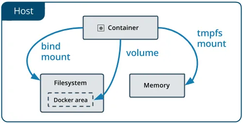

Unlike a bind mount, you can create and manage volumes outside the scope of any container.

[Share data between machines](#share-data-between-machines)

## Create and manage volumes 

**create a docker volume**

```bash +@Output
$ docker volume create volumename
$ docker volume create data-volume
```

**List Volumes** 

```bash +@Output
$ docker volume ls
```

**Inspect a volume**

```bash +@Output
$ docker volume inspect volumename
$ docker volume inspect data-volume
```

**Remove a volume**

```bash +@Output
$ docker volume rm volumename
$ docker volume rm data-volume
```

## Start a container with a volume

If you start a container with a volume that doesn't yet exist, Docker creates the volume for you. The following example mounts the volume `myvol2` into `/data` in the container.

```bash +@Output
$ docker run -d -it --name web-host -v myvol2:/data ubuntu:18.04
#or 
$ docker run -d -it --name web-host --mount source=myvol2,destination=/data ubuntu:18.04
```

**List docker volumes**

```bash +@Output
$ docker volume ls
$ docker volume inspect myvol2

```

**Login to container**

```bash +@Output
$  docker exec -it web-host /bin/bash
```

**Create new new file in the /data directory and exit container**

```bash +@Output
$  touch data/mydata.txt
$ ls data/
$ exit

```

**Validate if file is there on your existing host file system**

```bash +@Output
# Linux
$ ls -l /var/lib/docker/volumes

# Windows Docker Desktop
$ \\wsl.localhost\docker-desktop-data\data\docker\volumes
```

**Remove the web-host container and create a new container**

```bash +@Output
$ docker  rm -f web-host
$ docker run -d -it --name new-host -v myvol2:/data ubuntu:16.04
```

**login to container and list the files in /data folder**

```bash +@Output
$ docker exec -it new-host ls -l /data
 
```

## Mount local volume into docker container as volumes 

For this example, im using windows 10 machine running docker desktop on top of it 

**Step-1: Create a folder in your machine**

Create folder in `D://somefolder/myvol`. Make sure this path exists. 

**Step 2: Create a docker volume** 

```bash +@Output
docker volume create --name myvol --opt type=none --opt device=D://somefolder/myvol --opt o=bind
```

**Step 3: Run the container attaching this volume**

```bash +@Output
$ docker run -d -it --name web-host -v myvol:/myvol ubuntu:18.04

```

**Step 4: In your local machine, Go to the folder `D://somefolder/myvol` and create a file `hello.txt` and save it**

**Step 5: Exec in to the container and observe the file is present in the container**

```bash +@Output
$ docker exec -it web-host /bin/bash
# List all files and folders 
$ ls
# cd to myvol directory and observe the hello.txt file 
$ cd myvol
```

## Share data between machines


When building fault-tolerant applications, you may need to configure multiple replicas of the same service to have access to the same files.

Volume drivers allow you to abstract the underlying storage system from the application logic. For example, if your services use a volume with an NFS driver, you can update the services to use a different driver. For example, to store data in the cloud, without changing the application logic.

# Docker Network

Container networking refers to the ability for containers to connect to and communicate with each other, or to non-Docker workloads.

Containers have networking enabled by default, and they can make outgoing connections. A container has no information about what kind of network it's attached to, or whether their peers are also Docker workloads or not. A container only sees a network interface with an IP address, a gateway, a routing table, DNS services, and other networking details. That is, unless the container uses the none network driver.

## Network drivers 

Docker's networking subsystem is pluggable, using drivers. Several drivers exist by default, and provide core networking functionality:

### Bridge Network

The `default` network driver. If you don't specify a driver, this is the type of network you are creating. 

Bridge networks are commonly used when your application runs in a container that needs to communicate with other containers on the same host.

When you start Docker, a default bridge network (also called bridge) is created automatically, and newly-started containers connect to it unless otherwise specified.

**List Docker Network**

```bash +@Output
$ docker network ls
```

**Run a container**

```bash +@Output
$ docker run -d --name web01 --rm yeasy/simple-web
```

**List the container**

```bash +@Output
$ docker container ls
```

**Inspect the network** 

```bash +@Output
$ docker network inspect bridge
```
> You should see container in the list with a local IP like 172.17.0.2/16 with name web01

```bash +@Output
$ ping 172.17.0.2
```

**Stop the container**

```bash +@Output
$ docker container stop web01
```

**List the containers**

```bash +@Output
$ docker container ls
```

**Run the container**

```bash +@Output
$ docker run -d --name web01 -p8080:80 --rm yeasy/simple-web

$ ifconfig -a 

$ curl http://<public IP>:8080
# You can open the same link in browser
```

You can also create user-defined custom bridge networks. `User-defined` bridge networks are superior to the `default` bridge network.

**Advantages of user-defined bridges**

- User-defined bridges provide automatic DNS resolution between containers
- User-defined bridges provide better isolation
- Containers can be attached and detached from user-defined networks on the fly
- Each user-defined network creates a configurable bridge
- Linked containers on the default bridge network share environment variables

**Create a network**

```bash +@Output
$ docker network create my-net
```
**Connect a container to a user-defined bridge**

```bash +@Output
$ docker create --name mynginx --network my-net -p 8080:80 nginx
```

**Connect the running container to existing user-defined bridge**

```bash +@Output
$ docker network connect my-net mynginx
``` 

**Disconnect a running container from a user-defined bridge**

```bash +@Output
$ docker network disconnect my-net mynginx
```

### Host Network

If you use the host network mode for a container, that container's network stack is not isolated from the Docker host (the container shares the host's networking namespace), and the container does not get its own IP-address allocated. 

For instance, if you run a container which binds to port 80 and you use host networking, the container's application is available on port 80 on the host's IP address.

**Run a container**

```bash +@Output
$ docker run -d --name web02  --network=host --rm yeasy/simple-web
```

**List the container**

```bash +@Output
$ docker container ls
```

> Access url - http://<<public IP>> in browser

### None Network

If you want to completely isolate the networking stack of a container, you can use the --network none flag when starting the container. Within the container, only the loopback device is created.

**Run a container**

```bash +@Output
$ docker run -d --rm --name mybusybox --network none busybox sleep 5000 
```

**List the container**

```bash +@Output
$ docker container ls
```

**Login container**

```bash +@Output
$ docker exec -it mybusybox sh
#ifconfig
You will see no network interfaces other loopback

```

**Check network interfaces**

```bash +@Output
$ docker container ls
$ docker exec -it web01 sh
#ifconfig
You will see network interfaces 
```

```bash +@Output
$ docker container ls
$ docker exec -it web02 sh
#ifconfig
You will see network interfaces 
```

# Docker UI Portal 

`Portainer` is a `lightweight management UI` which allows you to easily manage your different Docker environments (Docker hosts or Swarm clusters). Portainer is meant to be as simple to deploy as it is to use. It consists of a single container that can run on any Docker engine (can be deployed as Linux container or a Windows native container, supports other platforms too). Portainer allows you to manage all your Docker resources (containers, images, volumes, networks and more) ! It is compatible with the standalone Docker engine and with Docker Swarm mode.

**Install Portainer**

```bash +@Output
$ docker volume create portainer_data
$ docker run -d -p 8000:8000 -p 8085:9000 -v /var/run/docker.sock:/var/run/docker.sock -v portainer_data:/data portainer/portainer

```

**Usage**
The UI can be accessed at http://portainer.docksal.

**Uninstall Portainer**

```bash +@Output
$ docker rm -vf portainer
$ docker volume rm -f portainer_data
```

# Docker file 

A Dockerfile is a `text document` that contains all the commands a user could call on the command line to assemble an image.

Docker can build images automatically by reading the instructions from a Dockerfile.

## Dockerfile commands

|** Instruction ** | ** Description **|
|------------------|-------------------|
|ADD|Add local or remote files and directories.|
|ARG | Use build-time variables.|
|CMD| Specify default commands.|
|COPY| Copy files and directories.|
|ENTRYPOINT| Specify default executable.|
|ENV |Set environment variables.|
|EXPOSE | Describe which ports your application is listening on.|
|FROM| Create a new build stage from a base image.|
|HEALTHCHECK |Check a container's health on startup.|
|LABEL| Add metadata to an image.|
|MAINTAINER| Specify the author of an image.|
|ONBUILD |Specify instructions for when the image is used in a build.|
|RUN |Execute build commands.|
|SHELL |Set the default shell of an image.|
|STOPSIGNAL |Specify the system call signal for exiting a container.|
|USER |Set user and group ID.|
|VOLUME |Create volume mounts.|
|WORKDIR |Change working directory.|


## Creating custom Docker images with Dockerfiles

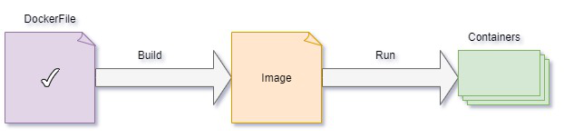

**Step-1: Run the base Nginx container**

```bash +@Output
$ docker run --name mynginxdefault -p 80:80 -d nginx
$ docker ps
$ docker stop mynginxdefault
```
> Access the URL http://localhost

**Step-2: Create Dockerfile and copy our customized index.html**

**Dockerfile**

```yaml
FROM nginx
COPY index.html /usr/share/nginx/html
```

**index.html**

```html
Welcome to Dockers Learning

```

**Step-3: Build Docker Image & run it**

From the folder where dockerfile & index.html exists, 

```bash +@Output
$ docker build -t reponame/mynginx_image1:v1 .
$ docker run --name mynginx1 -p 80:80 -d reponame/mynginx_image1:v1

```

**Step-4: Understanding Docker images and their layers**

Docker images are made up of multiple layers, which are essentially read-only filesystems. These layers are stacked on top of each other to form a single image. Understanding Docker image layers is important because it affects image size, build efficiency, and how images are cached and shared.

```bash +@Output
$ docker history reponame/mynginx_image1:v1
```
Focus on two column headers: CREATED BY and SIZE. The CREATED BY column shows the commands that were executed to generate the layers. And the SIZE column indicates the size of each layer. 

**Step-5: Tag & push the Docker image to docker hub**

```bash +@Output
$ docker images
$ docker tag reponame/mynginx_image1:v1 reponame/mynginx_image1:v1-release
$ docker push reponame/mynginx_image1:v1-release

```

**Step-5: Verify the same on docker hub**

Login to docker hub and verify the image we have pushed
Url: https://hub.docker.com/repositories

# Docker compose 

Compose is a tool for defining and running `multi-container` Docker applications. With Compose, you use a YAML file to configure your application's services. Then, with a single command, you create and start all the services from your configuration.

Compose works in all environments; production, staging, development, testing, as well as CI workflows.

**Key Features:**

- Have multiple isolated environments on a single host
- Preserve volume data when containers are created
- Only recreate containers that have changed
- Support variables and moving a composition between environments

**Using Compose is basically a 3 step process**

**Step-1:** Define your app's environment with a Dockerfile so it can be reproduced anywhere

**Step-2:** Define the services that make up your app in docker-compose.yaml so they can be run together in an isolated environment 

**Step-3:** Run docker compose up

## Docker compose commands 

|** Instruction ** | ** Description **|
|------------------|-------------------|
|build| Build or rebuild services|
|config| Parse, resolve and render compose file in canonical format|
|cp |Copy files/folders between a service container and the local filesystem|
|create| Creates containers for a service|
|down |Stop and remove containers, networks|
|events| Receive real time events from containers|
|exec| Execute a command in a running container|
|images| List images used by the created containers|
|kill| Force stop service containers|
|logs| View output from containers|
|ls |List running compose projects|
|pause |Pause services|
|port |Print the public port for a port binding|
|ps |List containers|
|pull| Pull service images|
|push |Push service images|
|restart| Restart service containers|
|rm |Removes stopped service containers|
|run| Run a one-off command on a service|
|start| Start services|
|stop| Stop services|
|top| Display the running processes|
|unpause| Unpause services|
|up| Create and start containers|
|version| Show the Docker Compose version information|


--{{1}}--
For more details, refer [official docs](https://docs.docker.com/compose/reference/)

# Best practices for creating efficient Docker images

**Use a Minimal Base Image**

Start with a minimal base image, such as Alpine Linux or BusyBox, to reduce the image size. These lightweight base images contain only essential components, which can significantly reduce the image footprint.

**Avoid Unnecessary Packages**

Install only the necessary packages and dependencies in your image. Remove any packages or files that are not required for your application to run. This reduces image size and potential security vulnerabilities.

**Multi-Stage Builds**

Use multi-stage builds to create smaller final images. This technique involves building your application in one image (with build tools) and then copying only the built artifacts into a smaller runtime image. This reduces the size of the final image while keeping the build tools out of it.

**Minimize Layers**

Minimize the number of layers in your image by grouping related commands together in a single RUN instruction. This reduces the number of intermediate layers and makes the image smaller and faster to build.

**Clean Up After Each Step**

Remove temporary files and cleanup after each step to reduce the image size. Use && to chain commands and remove unnecessary files in a single RUN instruction.

**Use .dockerignore**

Create a .dockerignore file to exclude unnecessary files and directories from being included in the image build context. This helps reduce the build context size and, consequently, the image size.

**COPY vs. ADD**

Use the COPY instruction instead of ADD when copying files into the image. COPY is simpler and more predictable, and it doesn't perform any automatic unpacking or URL downloads like ADD.

**Single Responsibility Principle**

Follow the Single Responsibility Principle (SRP) when creating images. Each image should have a single purpose or service. Avoid bundling multiple applications or services in a single image.

**Environment Variables**

Use environment variables for configuration and parameterization of your image. This allows you to change settings without modifying the image itself.

**Avoid Running as Root**

Whenever possible, avoid running processes inside the container as the root user. Create a non-root user and set appropriate permissions to enhance security.

**Health Checks**

Implement health checks in your Dockerfile using the HEALTHCHECK instruction. This helps Docker determine the health of the container, improving overall reliability and robustness.

**Reduce Image Complexity**

Keep your image's purpose clear and avoid unnecessary complexity. Minimize the number of exposed ports and avoid running multiple processes in a single container.

**Use .dockerignore and .gitignore**

Make sure to have a .dockerignore file for Docker-specific files and a .gitignore file for version control to exclude unnecessary files from the build context.

**Caching**

Be mindful of caching when writing your Dockerfile. Place frequently changing instructions toward the end of your Dockerfile to maximize caching benefits.

**Image Tagging and Versioning**

Tag and version your images to ensure you can easily identify and reference specific versions of your application.

**Security Scanning**

Use container security scanning tools to identify and remediate vulnerabilities in your images.

**Documentation**

Include clear and concise documentation in your Dockerfile and image metadata to help users understand how to use your image.

# Docker Essential Commands

- The below are the list of essential commands we are in need 

|     Commands                 |    Description                                  |
| ------------------------------- | --------------------------------------------- |
| docker ps | List all running containers |
| docker ps -a | List all containers stopped, running |
| docker stop container-id | Stop the container which is running |
| docker start container-id | Start the container which is stopped |
| docker restart container-id | Restart the container which is running |
| docker port container-id | List port mappings of a specific container |
| docker rm container-id or name | Remove the stopped container |
| docker rm -f container-id or name| Remove the running container forcefully |
| docker pull image-info | Pull the image from docker hub repository |
| docker pull swayaanthanu/springboot-todo-rest-api:1.0.0-RELEASE | Pull the image from docker hub repository |
| docker exec -it container-name /bin/sh | Connect to linux container and execute commands in container |
| docker rmi image-id | Remove the docker image |
| docker logout | Logout from docker hub |
| docker login -u username -p password | Login to docker hub |
| docker stats | Display a live stream of container(s) resource usage statistics |
| docker top container-id or name | Display the running processes of a container |
| docker version | Show the Docker version information |

# Assessment1 Build todoapi image and push to docker hub

**Post-program Assessment:**
All learners will be expected to create a docker image and share the public URL of the image as a successful completion:

- Create a docker Image for the specified Rest API project [TodoAPI] using docker file.
  
  - Pull the code from the repo, Git Repo: https://github.com/vijaynvb/todoapi 
  - Make required code changes in the Appilication.properties and POM.xml file to work with h2 database.
  - Build the jar
- Build Docker image.
- Push the image to docker hub as a public repository and share the public URL of the docker image

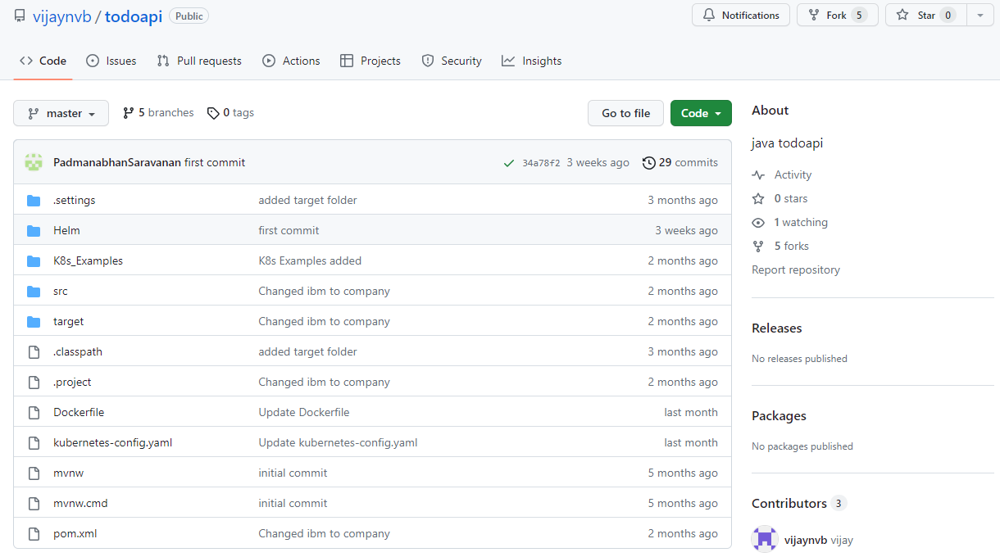

## Solution

**Step-1: Pull the code from git repository** 

- Access the URL https://github.com/vijaynvb/todoapi.git

**Step-2: Make required code changes in the Appilication.properties and POM.xml file to work with h2 database** 

**Step-3: Build a jar file**

**Step-4: Create Dockerfile and copy the content in the project root folder** 

NOTE: Ignore if Dockerfile already exists

**Dockerfile**

```yaml
FROM openjdk:11.0.15-jre
ADD target/*.jar app.jar
ENTRYPOINT ["java","-jar","app.jar"]

```

**Step-5: Build Docker Image & run it**

From the folder where dockerfile exists, 

```bash +@Output
$ docker build -t todoapi:v1 .
$ docker run --name todoapi -p 8080:80 -d todoapi:v1
```

>  Access the application **http://localhost:8080/swagger-ui.html**

**Step-6: Tag your image**

```bash +@Output
$ docker tag todoapi:v1 <reponame>/todoapi:v1 .
```

**Step-7: Push the Docker image to docker hub**

```bash +@Output
$ docker push <reponame>/helloworld:v1-release
```

**Step-8: Verify the same on docker hub** 

Login to docker hub and verify the image we have pushed

# Assessment2 Docker compose Todoapi with mysql

**Post-program Assessment:**
All learners will be expected to create a docker compose file and share the screenshots of the deployment as a successful completion:

- Create a docker compose file for the specified Rest API project [TodoAPI] using docker file.
  
  - Pull the code from the repo, Git Repo: https://github.com/vijaynvb/todoapi 
  - Make required code changes in the Appilication.properties and POM.xml file to work with mysql database.
  - Build the jar
- Build Docker image.
- Push the image to docker hub as a public repository. (ex: <reponame>/todoapimysql:1.0)
- Create a docker compose file to run multiple containers `todoapi` and `mysql` 
- Run the docker compose file 


## Solution

**Step-1: Clone the github repository** 

```bash +@Output
$ git clone https://github.com/vijaynvb/todoapi.git
```

**Step 2: Modify the application.properties file to configure your Spring Boot application to work with MySQL** 

Update the database connection properties such as `spring.datasource.url`, `spring.datasource.username`, and `spring.datasource.password`.

``` 
# src/main/resources/application.properties

spring.datasource.url=jdbc:mysql://${MYSQL_HOST:localhost}:${MYSQL_PORT:3306}/${MYSQL_DB:tododb}

spring.datasource.username=${MYSQL_USER:root}

spring.datasource.password=${MYSQL_PASSWORD:P@ssw0rd}

spring.jpa.properties.hibernate.dialect=org.hibernate.dialect.MySQL5InnoDBDialect

spring.jpa.hibernate.ddl-auto=update

spring.jpa.show-sql=true

```

**Step-3: Build the JAR**

Build the Spring Boot application to generate the JAR file.

```bash +@Output
$ ./mvnw clean package
```

**Step-4: Create Dockerfile and copy the content in the project root folder** 

NOTE: Ignore if Dockerfile already exists

**Dockerfile**

```yaml
FROM openjdk:11.0.15-jre
ADD target/*.jar app.jar
ENTRYPOINT ["java","-jar","app.jar"]

```

**Step-5: Build Docker Image & run it**

From the folder where dockerfile exists, 

```bash +@Output
$ docker build -t todoapimysql:1.0 .
```

**Step-6: Tag your image**

```bash +@Output
$ docker tag todoapimysql:1.0 <reponame>/todoapimysql:1.0 .
```

**Step-7: Push the Docker image to docker hub**

```bash +@Output
$ docker push <reponame>/todoapimysql:1.0
```

**Step 8: Create Docker Compose File**

Create a docker-compose.yml file in the project root to define services.

**File: docker-compose.yaml**

```yaml
version: '3.3'
services:
    todo-app:
        image: 'vijaynvb/todoapimysql:1.0'
        restart: always
        container_name: todo-app
        ports:
            - "8080:80"
        environment:
            - SPRING_DATASOURCE_USERNAME=root
            - SPRING_DATASOURCE_PASSWORD=P@ssw0rd
            - SPRING_DATASOURCE_URL=jdbc:mysql://mysqldb:3306/tododb
            - SPRING_JPA_DEFER_DATASOURCE_INITIALIZATION=true
        depends_on:
            - mysqldb 
             
    mysqldb:
        image: mysql:8
        restart: always
        container_name: mysqldb
        environment:
            - MYSQL_ROOT_PASSWORD=P@ssw0rd
            - MYSQL_DATABASE=tododb
        ports:
            - "3307:3306"

```

**Step 8: Run Docker Compose**

Run the Docker Compose to start the Spring Boot app and MySQL database.

```bash +@Output
$ docker-compose up
# If you want to run your services in the background, you can pass the -d flag (for "detached" mode) 
$ docker-compose up -d
```

Now, your Spring Boot Todo API should be up and running along with the MySQL database using Docker Compose. Access the API at `http://localhost:8080/swagger-ui.html`

# References 

For more information, 

- https://docs.docker.com/get-started/
- https://www.geeksforgeeks.org/docker-tutorial/
- https://docs.docker.com/compose/reference/
